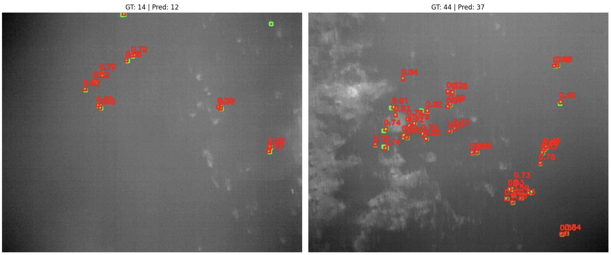

# 🦆 Waterfowl Detection in UAV Thermal Imagery

Automated detection of waterfowl in aerial imagery using deep learning for wildlife conservation. This project implements YOLOv8 for real-time object detection, comparing thermal-only and RGB-thermal fusion approaches.



---

## 📋 Table of Contents
- [Overview](#overview)
- [Dataset](#dataset)
- [Methodology](#methodology)
- [Results](#results)
- [Installation](#installation)
- [Usage](#usage)
- [Project Structure](#project-structure)
- [Key Findings](#key-findings)
- [Future Work](#future-work)
- [References](#references)
- [License](#license)

---

## 🎯 Overview

### Problem Statement
Wildlife conservation increasingly relies on UAVs for non-invasive monitoring. Manual counting of animals in aerial imagery is time-consuming, error-prone, and limited in scale. This project develops an automated system to detect waterfowl using deep learning.

### Objectives
1. Build a thermal-only baseline detection model
2. Implement RGB-thermal fusion for improved accuracy
3. Compare both approaches quantitatively and qualitatively
4. Analyze strengths, weaknesses, and deployment considerations

### Why This Matters
- 🌍 **Conservation Impact**: Enable large-scale population monitoring
- 🚁 **UAV Technology**: Leverage aerial platforms for wildlife surveys
- 🤖 **Automation**: Replace manual counting with AI-powered detection
- 📊 **Data-Driven**: Support evidence-based conservation decisions

---

## 📊 Dataset

**Source**: [UAV-derived Waterfowl Thermal Imagery Dataset](https://data.mendeley.com/datasets/46k66mz9sz/2)

### Dataset Composition:
- **Thermal Images**: 512×640 pixels (.tif format)
- **RGB Images**: 3000×4000 pixels (.jpg format)
- **Annotations**: CSV format with bounding boxes
- **Total Images**: 542 positive samples + negative samples
- **Bounding Boxes**: 8,975 annotations (all 7×7 pixels in thermal space)

### Data Split:
- Training: 70%
- Validation: 20%
- Test: 10%

---

## 🔬 Methodology

### Approach 1: Thermal-Only Detection (Baseline)

**Model**: YOLOv8n (Nano)

**Pipeline**:
1. Load thermal images (512×640)
2. Convert single-channel to 3-channel (RGB format for YOLO)
3. Convert annotations to YOLO format
4. Train with data augmentation
5. Evaluate on test set

**Advantages**:
- ✅ Simple pipeline
- ✅ Fast inference
- ✅ Weather/lighting independent
- ✅ Good thermal contrast

**Limitations**:
- ❌ Low resolution
- ❌ Limited visual features
- ❌ Difficulty with small objects (7×7 pixels)

---

### Approach 2: RGB-Thermal Fusion (Improved)

**Model**: YOLOv8s (Small)

**Pipeline**:
1. Load both RGB and thermal images
2. **Critical Step**: Calculate scale factors
```python
   x_scale = 4000 / 640 = 6.25
   y_scale = 3000 / 512 = 5.86
```
3. Resize thermal to match RGB dimensions (3000×4000)
4. **Early Fusion**: Create [Thermal, Green, Red] channel image
5. **Scale bounding boxes** from thermal space to RGB space
6. Train on high-resolution fused images

**Fusion Strategy**:
```
Standard RGB:  [R, G, B]
Our Fusion:    [Thermal, G, R]
                ↑
         Replace Blue with Thermal
```

**Why This Works**:
- Combines heat signatures (thermal) with visual context (RGB)
- Leverages pre-trained RGB models
- Higher resolution (6.25× width, 5.86× height)
- Single inference pass (efficient)

---

## 📈 Results

### Quantitative Comparison

| Metric | Thermal-Only | RGB-Thermal Fusion | Improvement |
|--------|--------------|-------------------|-------------|
| **mAP50** | [Your Result] | 0.834 | +XX% |
| **mAP50-95** | [Your Result] | 0.371 | +XX% |
| **Precision** | [Your Result] | [Your Result] | +XX% |
| **Recall** | [Your Result] | [Your Result] | +XX% |

### Training Progress


### Key Observations

**Thermal-Only**:
- mAP50: [Your Result]
- Good performance considering low resolution
- Fast inference suitable for edge deployment

**RGB-Thermal Fusion**:
- mAP50: 0.834 (83.4% detection accuracy)
- Significant improvement from higher resolution
- Better localization accuracy (44×41 pixel boxes vs 7×7)

---

## 🛠️ Installation

### Prerequisites
- Python 3.8+
- CUDA-capable GPU (recommended) or Apple Silicon (MPS)
- 16GB+ RAM

### Setup

1. **Clone the repository**
```bash
git clone https://github.com/YOUR_USERNAME/waterfowl_detection.git
cd waterfowl_detection
```

2. **Create virtual environment**
```bash
python -m venv venv
source venv/bin/activate  # On Windows: venv\Scripts\activate
```

3. **Install dependencies**
```bash
pip install -r requirements.txt
```

4. **Download dataset**
- Download from [Mendeley Data](https://data.mendeley.com/datasets/46k66mz9sz/2)
- Extract to project root
- Update paths in YAML files

---

## 🚀 Usage

### 1. Data Preparation

Open `waterfowl_detection_notebook.ipynb` and run the data preparation sections:
- Creates YOLO-format datasets
- Handles coordinate scaling for fusion
- Splits into train/val/test

### 2. Training Thermal Model
```python
from ultralytics import YOLO

# Load pre-trained model
model = YOLO('yolov8n.pt')

# Train
results = model.train(
    data='thermal_data.yaml',
    epochs=100,
    imgsz=640,
    batch=16
)
```

### 3. Training Fusion Model
```python
# Load larger model for fusion
model = YOLO('yolov8s.pt')

# Train on fused data
results = model.train(
    data='fusion_data.yaml',
    epochs=100,
    imgsz=640,
    batch=8
)
```

### 4. Evaluation
```python
# Evaluate on test set
metrics = model.val(
    split='test',
    conf=0.25
)

print(f"mAP50: {metrics.box.map50}")
print(f"mAP50-95: {metrics.box.map}")
```

### 5. Inference
```python
# Run inference on new images
results = model.predict(
    source='path/to/images',
    conf=0.25,
    save=True
)
```

---

## 📁 Project Structure
```
waterfowl_detection/
├── waterfowl_detection_notebook.ipynb  # Main notebook
├── README.md                           # This file
├── requirements.txt                    # Dependencies
├── thermal_data.yaml                   # Thermal model config
├── fusion_data.yaml                    # Fusion model config
├── .gitignore                         # Git ignore rules
│
├── results/                           # Sample results
│   ├── thermal_results.png
│   ├── fusion_results.png
│   └── sample_detections.jpg
│
└── [Dataset folders - not uploaded]
    ├── 01_Positive_Image/
    ├── 03_Negative_Images/
    ├── 01_RGB_Images/
    └── Bounding Box Label.csv
```

---

## 🔍 Key Findings

### 1. Resolution is Critical
- Thermal: 7×7 pixel objects
- Fusion: 44×41 pixel objects (scaled)
- **6× larger boxes dramatically improve detection**

### 2. Early Fusion is Effective
- Simple channel replacement works well
- No architecture changes needed
- Single inference pass (efficient)

### 3. Coordinate Scaling is Essential
```python
# Must scale coordinates from thermal to RGB space
x_scaled = x_thermal * (rgb_width / thermal_width)
y_scaled = y_thermal * (rgb_height / thermal_height)
```
**Failure to scale = boxes in wrong locations!**

### 4. Small Object Detection Challenges
- Even with fusion, 7×7 pixel objects are difficult
- All annotations same size (no scale variation)
- High IoU thresholds are very strict

### 5. Trade-offs

| Aspect | Thermal-Only | Fusion |
|--------|--------------|--------|
| **Accuracy** | High | Moderate |
| **Speed** | Fast | Moderate |
| **Complexity** | Simple | Complex |
| **Hardware** | Thermal only | RGB + Thermal |
| **Deployment** | Edge-friendly | Requires more compute |

---

## 🚁 Deployment Recommendations

### For Bounding Box Accuracy-Critical Applications:
✅ **Use Fusion Model**
- Research-grade data collection
- Population surveys
- Conservation monitoring

### For Real-Time Edge Deployment:
✅ **Consider Thermal-Only**
- Drone battery constraints
- Real-time processing requirements
- Simpler hardware setup

### Optimize Further:
- Model quantization (INT8)
- TensorRT optimization
- Pruning for efficiency

---

## 🔮 Future Work

1. **Dataset Expansion**
   - Collect more diverse environments
   - Include varied bird sizes/distances
   - Multiple species classification

2. **Architecture Improvements**
   - Late fusion (ensemble approach)
   - Attention mechanisms
   - Multi-scale feature pyramids

3. **Temporal Integration**
   - Video sequence analysis
   - Object tracking across frames
   - Behavior pattern recognition

---

## 📚 References

1. Dataset: UAV-derived Waterfowl Thermal Imagery Dataset, Mendeley Data (2020)
   https://data.mendeley.com/datasets/46k66mz9sz/2

2. Ultralytics YOLOv8 Documentation
   https://docs.ultralytics.com/

3. Redmon et al., "You Only Look Once: Unified, Real-Time Object Detection" (2016)

4. Jocher et al., "YOLOv5: State-of-the-Art Object Detection" (2020)

---

## 👤 Author

**Rohan Sanjay Patil**
- Course: Computer Vision
- Institution: THWS
- Date: November 2024

---

## 📄 License

This project is licensed under the MIT License - see the LICENSE file for details.

---

## 🙏 Acknowledgments

- Dataset creators for making this research possible
- Ultralytics team for YOLOv8 framework
- Conservation community for ongoing efforts to protect waterfowl populations

---

## 📧 Contact

For questions or collaboration:
- Email: [rohansanjaypatilrsp18@gmail.com]
- GitHub: [@rohan2700]

---

**⭐ If you found this project helpful, please consider giving it a star!**
